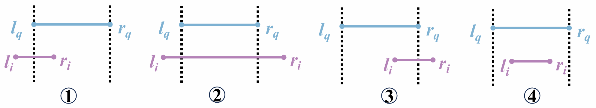

# MSTG: Labeled Multi-Segment Tree Index For Range-Range Filtering ANN search
This is the official implementation of the paper **Augment Range-Filtering Approximate Nearest Neighbor Search: Handling Data with Range Attributes**


## Range-Range Filters

There are **four atomic range filter conditions** between the object range $[l_i, r_i]$ and the query range $[l_q, r_q]$, as shown in the figure below:



The four atomic conditions are defined as:

1. $l_i \leq l_q \leq r_i \leq r_q$
2. $l_i \leq l_q \leq r_q \leq r_i$
3. $l_q \leq l_i \leq r_q \leq r_i$
4. $l_q \leq l_i \leq r_i \leq r_q$

Any range-range filter can be expressed as a combination (OR) of these atomic cases.

## Build Instructions

### Prerequisites

- GCC 11+
- CMake 3.22+

### Build

```bash
cd MSTG/
bash build.sh
```

Or manual build:

```bash
cd MSTG/
mkdir build && cd build
cmake -DCMAKE_BUILD_TYPE=Release ..
make -j
```

This will generate four executables in `/build/test/`:

* `build_intersection` – Builds the RRANN index supporting composite range-range filters of the form
  **① ∨ ② ∨ ③ ∨ ④**

* `search_intersection` – Performs search on the RRANN index using the same composite range-range filter
  **① ∨ ② ∨ ③ ∨ ④**

* `build_range` – Builds the RFANN index for arbitrary range filters

* `search_range` – Performs search on the RFANN index


## Range Generation

You can generate range files for **RRANN** and **RFANN** using the following commands:

* **Base range for RFANN**:

  ```bash
  python3 utils/gen_base_rfann.py <output_path> <num_points>
  ```

  Example:

  ```bash
  python3 utils/gen_base_rfann.py rfann.range 1000000
  ```

* **Base range for RRANN**:

  ```bash
  python3 utils/gen_base_rrann.py <output_path> <num_points> <categories>
  ```

  Example:

  ```bash
  python3 utils/gen_base_rrann.py rrann.range 1000000 10000
  ```

* **Query range generation**:

  ```bash
  ./build/gen_query_range <base_range_path> <categories>
  ```

### Notes

* `<output_path>`: Path to the output `.range` file.
* `<num_points>`: Number of intervals to generate.
* `<categories>`: The domain size (e.g., 10000 means range values are in \[0, 9999]).
* `<base_range_path>`: Path to an existing base `.range` file used as input to generate queries.


## Index Construction

To build the RRANN index with composite range-range filters (① ∨ ② ∨ ③ ∨ ④):

```bash
./build_intersection \
  --data_path path/to/data.fbin \
  --data_range_path path/to/data.range \
  --index_path path/to/output.index \
  --M 32 \
  --ef_construction 200 \
  --threads 16
```

To build the RFANN index for arbitrary range filters:

```bash
./build_range \
  --data_path path/to/data.fbin \
  --data_range_path path/to/data.range \
  --index_path path/to/output.index \
  --M 16 \
  --ef_construction 200 \
  --threads 16
```

### Parameters

| Argument              | Description                                      |
|-----------------------|--------------------------------------------------|
| `--data_path`         | Path to input vector file (`.fbin` format)       |
| `--data_range_path`   | Path to scalar attribute range file (`.range`)   |
| `--index_path`        | Path to save the output index                    |
| `--M`                 | Max number of neighbors per node                 |
| `--ef_construction`   | Graph building ef parameter                      |
| `--threads`           | Number of construction threads                   |

---

## Search

To search with the RRANN index (supports composite range-range filters ① ∨ ② ∨ ③ ∨ ④):

```bash
./search_intersection \
  --data_path path/to/data.fbin \
  --query_path path/to/query.fbin \
  --query_range_path path/to/query_ranges \
  --groundtruth_path path/to/groundtruth \
  --index_file path/to/output.index \
  --result_path path/to/results/result.csv \
  --base_range_path path/to/base_ranges \
  --M 32
```

To search with the RFANN index (supports arbitrary range filters):

```bash
./search_range \
  --data_path path/to/data.fbin \
  --query_path path/to/query.fbin \
  --query_range_path path/to/query_ranges \
  --groundtruth_path path/to/groundtruth \
  --index_file path/to/output.index \
  --result_path path/to/results/result.csv \
  --base_range_path path/to/base_ranges \
  --M 16
```


### Parameters

| Argument             | Description                                                 |
| -------------------- | ----------------------------------------------------------- |
| `--data_path`        | Path to base data vectors (`.fbin`)                         |
| `--query_path`       | Path to query vectors (`.fbin`)                             |
| `--query_range_path` | Path to the query range file                                |
| `--groundtruth_path` | Path to ground truth result file                            |
| `--index_file`       | Path to the index file generated during index construction  |
| `--result_path`      | Path to save the final search result                        |
| `--base_range_path`  | Path to base vector range file                              |
| `--M`                | Number of neighbors per node; must match index build config |


## Data Format

### `.fbin` (Float Binary Format)
Binary format for vectors:
```
[int32]   points_num
[int32]   dimension (D)
[float]   D values of vector 1
[float]   D values of vector 2
...
```

### `.range` Format
Each line contains a scalar range for one vector:
```
[range_start] [range_end]
```
